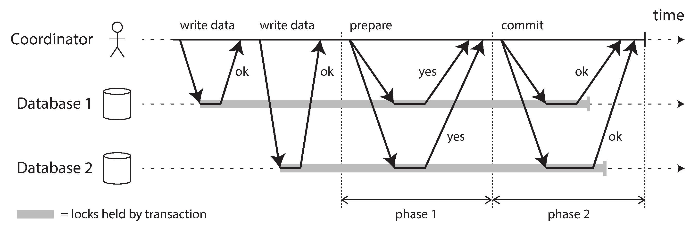
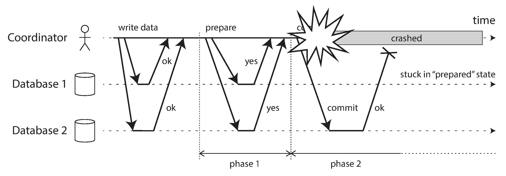

> Atomic Commit Protocol, Atomicity

<!-- more -->

### Problem
假设有一张 accounts 表，其记录保存在多个分区，用户 Alice 与 Bob 分别存在分区 A 和分区 B，假设需要从 Alice 的账户转账 1000 元至 Bob 的账户，可能的 SQL 代码如下：
```sql
begin transaction;
update accounts set balance = balance - 1000 where username='foo'; -- partition A
update accounts set balance = balance + 1000 where username='har'; -- partition B
commit;
```

### Two Phase Commit

2PC 的基本流程是：
1. 阶段一，协调者发送 CanCommit 消息，询问参与者是否可以提交事务，当且仅当所有参与者回复 "yes" 时，进入阶段二。如果任意参与者否决事务，或者超时，则协调者向所有参与者发送终止事务的请求。
2. 阶段二，协调者向所有参与者发送 DoCommit 消息，参与者收到该消息后提交事务。如果协调者宕机，或者网络出现分区，参与者将阻塞等待直至协调者或网络恢复。

细节：
1. 当一个应用试图开始一个事务时，先想协调者申请一个事务 id，该 id 必须全局唯一。
2. 应用使用唯一事务 id 与不同的事务参与者发送交互，此阶段如果出错，协调者或任意参与者可以终止事务。
3. 当程序准备好提交事务时，协调者向所有参与者发送对应事务 id 的预提交请求，如果任一请求出错或超时，则协调者向所有参与者发送终止请求。
4. 当参与者收到预提交请求时，如果它回复 "yes" ，则必须保证当收到真正的提交请求时，能够成功提交。换句话说，一旦回复 "yes"，则视为该节点放弃了终止事务的权利。
5. 当协调者收到所有参与者的回复后，协调者必须做出提交或终止的决定，当且仅当所有人回复 "yes" 时决定提交，否则决定终止，同时它必须将该决定写入磁盘。
6. 一旦协调者将决定写入磁盘后，将结果发送给所有参与者，如果发送过程出现失败或延迟，则必须无限重试直至成功为止。如果此时某个参与者宕机，则事务将会在该参与者恢复时提交。

如果预提交请求失败或超时，则协调者终止事务。如果是提交请求或终止请求超时，则协调者无限重试，直至成功为止。

整个过程有点类似西方婚礼，证婚人询问新娘与新郎是否愿意与对方结婚，如果双方都回答 "yes"，则证婚人宣布他们的婚礼已成事实。新娘与新郎有权回答 "no" 来终止婚礼，但一旦回答过 "yes" 就没有机会反悔，如果新娘在回答过 "yes" 之后陷入昏迷而没有听到证婚人说出“你们现在已是合法夫妻”，这也改变不了最终的结果，当她从昏迷中苏醒后，她可以询问证婚人最后的结果，或者等待证婚人主动将结果告诉她。

如果协调者在发送预提交请求前失败，则参与者可以终止事务，一旦参与者回复 "yes" 过后，它就不允许单方面的终止事务，如下图所示：

这时参与者（Database1）不知道到底该提交还是终止该事务，它唯一能做的就是等待协调者从失败中恢复，这也是为什么一旦协调者做出决定就要把该决定写入磁盘的原因。

分析上面的流程，可以看到一个参与者可能有三种状态：
1. 初始状态：当参与者第一次收到事务请求是处在该状态。
2. 确定状态：当参与者知道自己应该提交还是终止时的状态。
2. 不确定状态（也被称为预提交状态）：当参与者回复 "yes" 后，等待协调者回复时的状态。

如果一个协调者在参与者处在不确定状态时宕机，则这些参与者将阻塞等待协调者从错误中恢复。

### Three Phase Commit
> A non-blocking commit protocol is one in which the failure of a single
process does not prevent the other processes from deciding if the transaction
is committed or aborted. They are often called Three-Phase Commit proto-
cols. Several have been proposed, and a few have been implemented [?, ?, ?].
They have usually attempted to “fix” the Two-Phase Commit protocol by
choosing another TM if the first TM fails. However, we know of none that
provides a complete algorithm proven to satisfy a clearly stated correctness
condition. For example, the discussion of non-blocking commit in the clas-
sic text of Bernstein, Hadzilacos, and Goodman [?] fails to explain what a
process should do if it receives messages from two different processes, both
claiming to be the current TM. Guaranteeing that this situation cannot
arise is a problem that is as difficult as implementing a transaction commit
protocol.

1. 阶段一，协调者向参与者发送 CanCommit 询问是否可以提交事务，当且仅当协调者收到所有肯定答复时进入阶段二，如果任意参与者否决事务，或者超时，则协调者向所有参与者发送终止事务的请求。
2. 阶段二，协调者向参与者发送 PreCommit 消息，参与者返回 Ack 消息。当且仅当协调者收到所有肯定答复时进入阶段三，如果任意参与者超时，则协调者向所有参与者发送终止事务的请求。如果协调者在发送 PreCommit 消息前宕机，参与者等待 PreCommit 消息超时，该事务将被终止。
3. 阶段三，协调者向参与者发送 DoCommit 消息，当参与者收到该消息时提交事务。如果协调者在发送 DoCommit 消息前宕机，参与者等待 DoCommit 消息超时，该事务将被提交。

上面的流程有一个重要的漏洞，如果阶段二协调者在发送了一部分 PreCommit 消息后宕机，这时参与者的行为将存在分歧，未收到 PreCommit 的参与者会因为超时而终止事务，收到 PreCommit 的参与者会因为等待 DoCommit 超时而提交事务。换句话说，三阶段提交并不能真正保证提交的原子性。

### XA?

### Starbucks Doesn’t Use Two Phase Commit
- Write-off
    不做任何处理
- Retry
    在失败的节点重试
- Compensating action
    事务补偿

2PC 带来的一致性价值与其对系统吞吐量的冲击相比不值一题。

2PC 的初衷就是保证系统多个节点间的一致性，如果该一致性对你来说并不重要，那么你当然不需要使用 2PC。

### Two Phase Commit vs Fault-Tolerant Consensus

### Atomic Commit Protocol vs Distributed Transaction?


如果我们采用二阶段提交协议，那么出于网络原因，分区 A 与 分区 B 收到 DoCommit 消息的时间可能不一致。

### Reference
- [Three Phase Commit](http://courses.cs.vt.edu/~cs5204/fall00/distributedDBMS/sreenu/3pc.html)